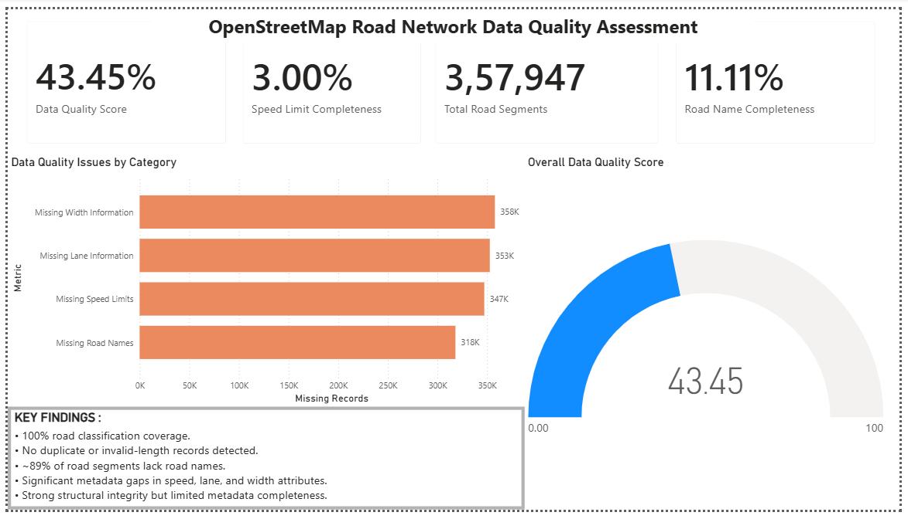
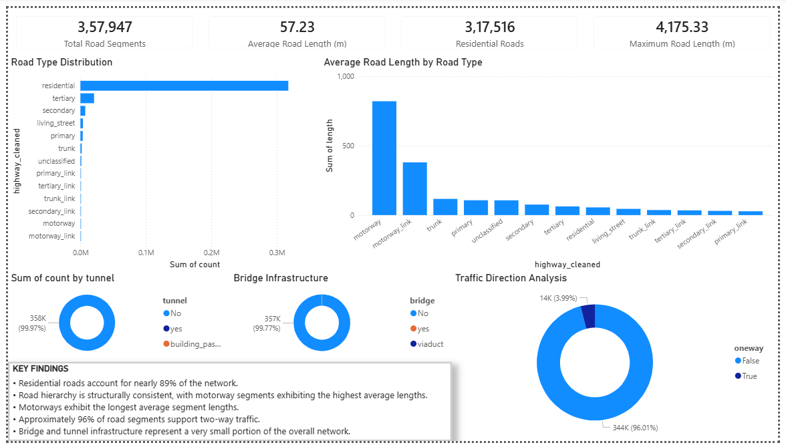
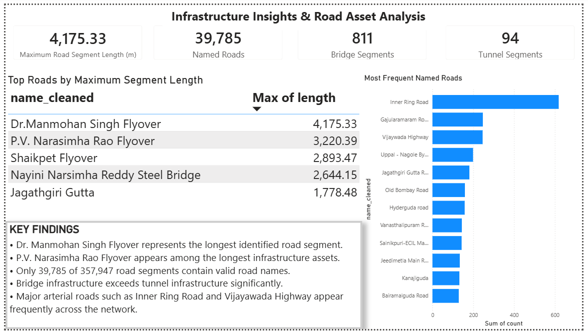

# OpenStreetMap Road Network Validation & Analysis

## Project Overview

This project focuses on assessing the quality, completeness, and structural characteristics of OpenStreetMap (OSM) road network data using Python and Power BI.

The objective was to simulate a real-world Data Quality Analyst / Mapping Analyst workflow by validating large-scale road network data, identifying metadata issues, analyzing road infrastructure patterns, and building interactive dashboards for reporting and decision-making.

---

## Project Objectives

- Validate OpenStreetMap road network data
- Identify missing and inconsistent attributes
- Measure overall data quality
- Analyze road hierarchy and network structure
- Evaluate infrastructure components such as bridges and tunnels
- Build interactive Power BI dashboards to communicate findings

---

## Dataset

**Source:** OpenStreetMap (OSM)

**Region:** Hyderabad, India (Southern Zone)

### Dataset Size

| Metric | Value |
|----------|----------:|
| Road Segments | 357,947 |
| Network Nodes | 137,679 |
| Road Attributes | 20+ |

---

## Tools & Technologies

- Python
- Pandas
- OSMnx
- NetworkX
- Power BI
- Excel
- Git & GitHub

---

## Project Workflow

### 1. Data Extraction

Road network data was extracted from OpenStreetMap using OSMnx and converted into node and edge datasets.

### 2. Data Validation

Custom validation checks were developed to identify:

- Missing road names
- Missing speed limits
- Missing lane information
- Missing width information
- Duplicate records
- Invalid road lengths
- Inconsistent road classifications

### 3. Data Cleaning

Data cleaning procedures included:

- Road type standardization
- Road name normalization
- Handling list-based category values
- Missing value assessment

### 4. Network Analysis

The road network was analyzed to understand:

- Road type distribution
- Average road length by category
- Traffic direction patterns
- Bridge infrastructure
- Tunnel infrastructure
- Longest road segments
- Most frequently occurring road names

### 5. Dashboard Development

Power BI dashboards were developed to visualize:

- Data quality metrics
- Road network structure
- Infrastructure insights

---

# Key Findings

### Data Quality Assessment

- 100% road classification coverage
- No duplicate records detected
- No invalid road lengths identified
- Approximately 89% of road segments lacked road names
- Significant metadata gaps existed in speed limit, lane count, and width attributes

### Road Network Analysis

- Residential roads account for nearly 89% of the network
- Motorways exhibited the highest average segment lengths
- Road hierarchy followed expected transportation patterns
- Approximately 96% of road segments support two-way traffic

### Infrastructure Insights

- Dr. Manmohan Singh Flyover was identified as the longest road segment
- P.V. Narasimha Rao Flyover appeared among the largest infrastructure assets
- Bridge infrastructure significantly exceeded tunnel infrastructure
- Inner Ring Road was the most frequently occurring named road

---

## Dashboard Pages

### Page 1 – Data Quality Assessment

Features:

- Data Quality Score
- Road Name Completeness
- Speed Limit Completeness
- Missing Attribute Analysis
- Validation Findings

### Page 2 – Road Network Structure Analysis

Features:

- Road Type Distribution
- Average Road Length by Type
- Traffic Direction Analysis
- Bridge Infrastructure Analysis
- Tunnel Infrastructure Analysis

### Page 3 – Infrastructure Insights

Features:

- Longest Road Segments
- Most Frequent Road Names
- Infrastructure KPIs
- Network Insights

---

## Project Structure

```text
OpenStreetMap-Road-Network-Validation

├── data
│   ├── nodes.csv
│   └── roads_sample.csv

├── scripts
│   ├── download_osm_data.py
│   ├── validation.py
│   ├── analysis.py

├── outputs
│   ├── validation_summary.csv
│   ├── cleaned_roads.csv
│   ├── road_type_distribution.csv
│   ├── average_length_by_type.csv
│   ├── oneway_analysis.csv
│   ├── bridge_analysis.csv
│   ├── tunnel_analysis.csv
│   ├── longest_roads.csv
│   └── top_road_names.csv

├── powerbi
│   └── OpenStreetMap_Road_Network_Validation.pbix

├── screenshots
│   ├── page1_data_quality.png
│   ├── page2_network_analysis.png
│   └── page3_infrastructure_insights.png

├── README.md
├── requirements.txt
└── .gitignore
```

---

## Dashboard Screenshots

### Data Quality Assessment



### Road Network Structure Analysis



### Infrastructure Insights



---

## How to Run

### Clone Repository

```bash
git clone https://github.com/YOUR_USERNAME/OpenStreetMap-Road-Network-Validation.git
```

### Install Dependencies

```bash
pip install -r requirements.txt
```

### Run Validation

```bash
python scripts/validation.py
```

### Run Analysis

```bash
python scripts/analysis.py
```

---

## Future Improvements

- Geospatial mapping visualizations
- Route connectivity analysis
- Road network graph metrics
- Interactive map integration
- Automated data quality monitoring

---

## Author

Mithil

Data Analytics | Business Analytics | Data Quality & Validation Projects
